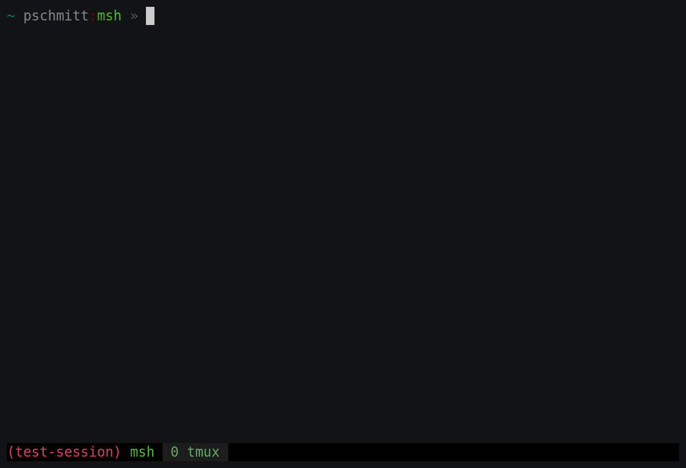

# 🎛️ TMUX SSH Split

[](https://asciinema.org/a/335250)

This plugin is a modern iteration of the sshh concept. It enables seamless SSH
splits. If you're in an SSH session in the current pane and press the designated
key, the pane will split, and the newly created pane will host an SSH session
connected to the host you were previously on. If there's no active SSH session,
a regular split will occur.

## 📥 Installation

You can install this plugin using [TPM](https://github.com/tmux-plugins/tpm):

```
set -g @plugin 'pschmitt/tmux-ssh-split'
```

## 🛠️ Configuration

To use this plugin, you need to set at least one of the `ssh-split-h-key`
or `ssh-split-v-key` options. These keys will be bound to the horizontal and
vertical split, respectively.

## ⚙️ Options

| Option | Description | Default Value |
| --- | --- | --- |
| `@ssh-split-keep-cwd` | Determines whether the starting directory of the new pane should be the same as the current pane. This is similar to executing `tmux split -c "#{pane_current_path}"`. | `false` |
| `@ssh-split-keep-remote-cwd` | Similar to the above, but for remote (SSH) splits. Note that remote path detection depends on PS1 parsing, so it won't work if your prompt doesn't contain the current path. This works best with `@ssh-split-strip-cmd=true` | `false` |
| `@ssh-split-fail` | Determines whether to do nothing if the current pane isn't running SSH. By default, a normal split will occur. | `false` |
| `@ssh-split-no-env` | If set to true, this will not set `TMUX_SSH_SPLIT=1` in splits (see tips and tricks section) | `false` |
| `@ssh-split-no-shell` | If set to true, this will prevent a shell session from spawning after the SSH session, causing the pane to exit when the SSH session ends. | `false` |
| `@ssh-split-strip-cmd` | If set to true, the SSH command executed in the new pane will be stripped of the remote command portion. For example, if you're running `ssh HOST COMMAND` in a pane and you split it, tmux-ssh-split will create a new pane with a start command of `ssh HOST`. | `false` |
| `@ssh-split-verbose` | Displays a message before the SSH command is spawned with the command being executed | `false` |
| `@ssh-split-debug` | Debug mode. Redirects the script output to `/tmp/tmux-ssh-split.log`. | `false` |

### 💡 Example config

```
set-option -g @ssh-split-keep-cwd "true"
set-option -g @ssh-split-keep-remote-cwd "true"
set-option -g @ssh-split-fail "false"
set-option -g @ssh-split-no-env "false"
set-option -g @ssh-split-no-shell "false"
set-option -g @ssh-split-strip-cmd "true"
set-option -g @ssh-split-verbose "true"
set-option -g @ssh-split-debug "false"
set-option -g @ssh-split-h-key "|"
set-option -g @ssh-split-v-key "S"

set -g @plugin 'pschmitt/tmux-ssh-split'
```

## 🔌 Compatibility with Other Plugins

Some plugins may attempt to bind the same keys as tmux-ssh-split. For instance,
[tmux-pain-control](https://github.com/tmux-plugins/tmux-pain-control) is one
such plugin. With the example configuration provided, both tmux-ssh-split
and tmux-pain-control would try to bind the `|` key. The plugin loaded last
will prevail.

### ✅ Solution

I've sent
[a PR to fix this](https://github.com/tmux-plugins/tmux-pain-control/pull/33)
upstream. In the meantime you can
[use my fork](https://github.com/pschmitt/tmux-pain-control/).

To make the **forked** `tmux-pain-control` not bind the `|` key you can set
the following:

```
set -g @disabled_keys "|"
```

## 🎩 Tips and Tricks

If you want to determine whether a command has been spawned via tmux-ssh-split
in a local or remote split, you can check for the `TMUX_SSH_SPLIT` environment
variable. It should be set to `1` for all splits. If `TMUX_SSH_SPLIT` is not set
on remote splits, ensure that `TMUX_SSH_SPLIT` is listed in the `AcceptEnv`
property in your sshd config. For example:

```
AcceptEnv LANG LC_* TMUX_SSH_SPLIT
```

🤚 If you want to disable this feature add the following to your TMUX config:

```
set-option -g @ssh-split-no-env "true"
```

## 📜 License

This project is open source and available under the terms of the
[GNU General Public License v3.0](./LICENSE)
